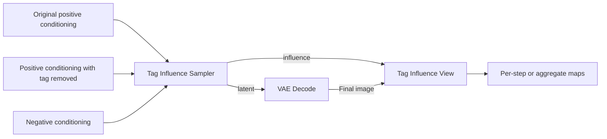

# Anima Tag Influence

[English](README.md) | [한국어](README_KR.md) | [Attention heatmaps](README__HEATMAP.md)

ComfyUI custom nodes for comparing where a prompt tag affects an image and when its influence appears during generation.

At each step, the nodes compare predictions for the original positive prompt and a positive prompt with the selected tag removed, using the same generation state. Locations with larger prediction changes appear brighter. The original prediction advances generation to the next step.



Arrows represent connections between node outputs and inputs.

## Run in Colab

[Open in Colab](https://colab.research.google.com/github/HisameOgasahara/Anima_HEATMAP/blob/feature/tag-influence/notebooks/Anima_Heatmap_ComfyUI.ipynb)

1. Select a GPU runtime and run the cells in order. `SOURCE_REF` defaults to `feature/tag-influence`.
2. Keep the downloaded `tag_influence.json`.
3. Open the ComfyUI link from the server cell and drag the JSON onto the canvas.
4. Select the models, adjust the prompts and sampling settings, and run.

Anyone with the connection URL can access ComfyUI. Keep the server cell running while using it; press the cell's stop button to end the session.

## Local installation

Windows cmd:

```bat
git clone --branch feature/tag-influence --single-branch https://github.com/HisameOgasahara/Anima_HEATMAP.git
cd Anima_HEATMAP
uv pip install --python "<ComfyUI Python path>" -e .
xcopy comfyui_anima_heatmap "<ComfyUI path>\custom_nodes\comfyui_anima_heatmap\" /E /I
```

Restart ComfyUI and drag the [example workflow](example/tag_influence.json?raw=true) onto the canvas.

| Node | Model / setting |
| --- | --- |
| `UNETLoader` | `anima-base-v1.0.safetensors` |
| `CLIPLoader` | `qwen_3_06b_base.safetensors`, type `stable_diffusion` |
| `VAELoader` | `qwen_image_vae.safetensors` |

Model files: [Anima Base](https://huggingface.co/circlestone-labs/Anima).

## Compare a tag

The example measures the effect of removing `red shirt`.

| Input | Prompt |
| --- | --- |
| `positive` | `1girl, solo, upper body, looking at viewer, outdoors, daytime, red shirt` |
| `ablated_positive` | `1girl, solo, upper body, looking at viewer, outdoors, daytime` |
| `negative` | `low quality, worst quality, blurry` |

Encode both positive prompts with the same CLIP. Change the tag being compared to a character, artist, expression, object, background, or another prompt tag. Removing several tags together measures their combined effect.

Connect the Sampler's `latent` to VAE Decode, then connect the final image and `influence` to `Tag Influence View`. Connect View's `overlays` or `heatmaps` output to Preview Image.

## Steps and display settings

The Sampler accepts the same `steps`, `seed`, `cfg`, `sampler_name`, `scheduler`, and `denoise` inputs as KSampler. Measurements follow the actual noise schedule when `steps` changes. The example's 30 steps can be changed to another count.

| View input | Behavior |
| --- | --- |
| `view=per_step` | Average measurements within each step interval and output a map per step |
| `view=aggregate` | Average all measurements belonging to the selected steps |
| `steps=all` / `last` | Select all steps / the last step |
| `steps=0,4,8` / `0-9` | Select particular steps / a range. Inputs start at 0; image labels start at 1 |
| `scale_max=0` | Use the maximum across all measurements as a shared color scale |
| `scale_max>0` | Fix the color scale to the specified maximum |
| `alpha` | Opacity of the colors overlaid on the final image |

For samplers that evaluate the model several times per step, calls are grouped by noise schedule interval. Model-call count can therefore differ from sampling-step count. `details` includes measurements by step, call, and sigma, along with the output order.

Changing only View settings redisplays the measurements held in memory. Changing the comparison prompt runs sampling again.

## Interpretation and resources

Map values are the latent-channel L2 magnitude of the difference between the two CFG predictions, divided by sigma, at the same generation state and sigma. The effect of removing a tag includes changes to the prompt's context.

Per-step maps are overlaid on the final generated image. Comparison predictions do not accumulate into subsequent steps; the original positive and negative conditions determine the CFG prediction that advances generation.

The same model performs the additional comparison calculations, and difference maps are stored in CPU memory. Comparing one tag under ordinary CFG approximately doubles the theoretical model computation. Actual runtime and peak VRAM depend on resolution, sampler, and memory placement. Colab GPU execution and peak VRAM for this feature have not yet been measured.
