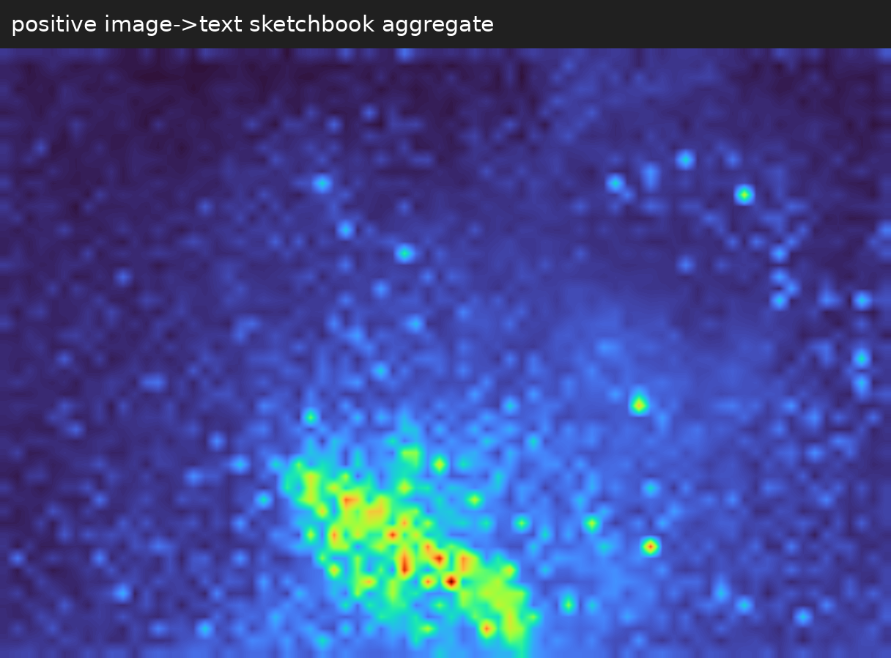
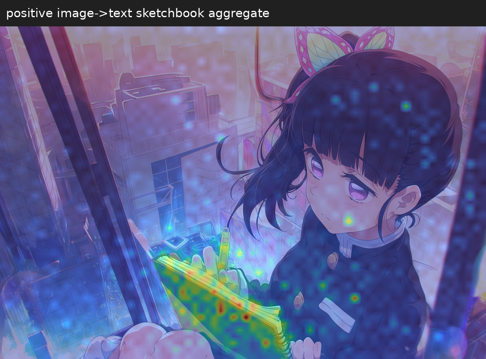
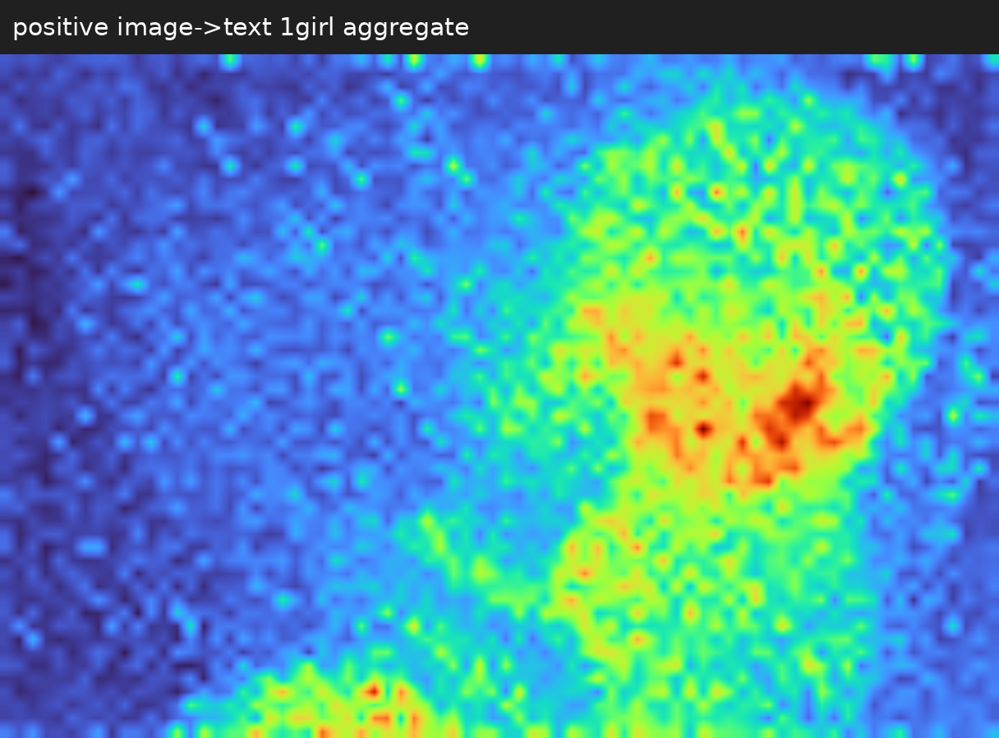
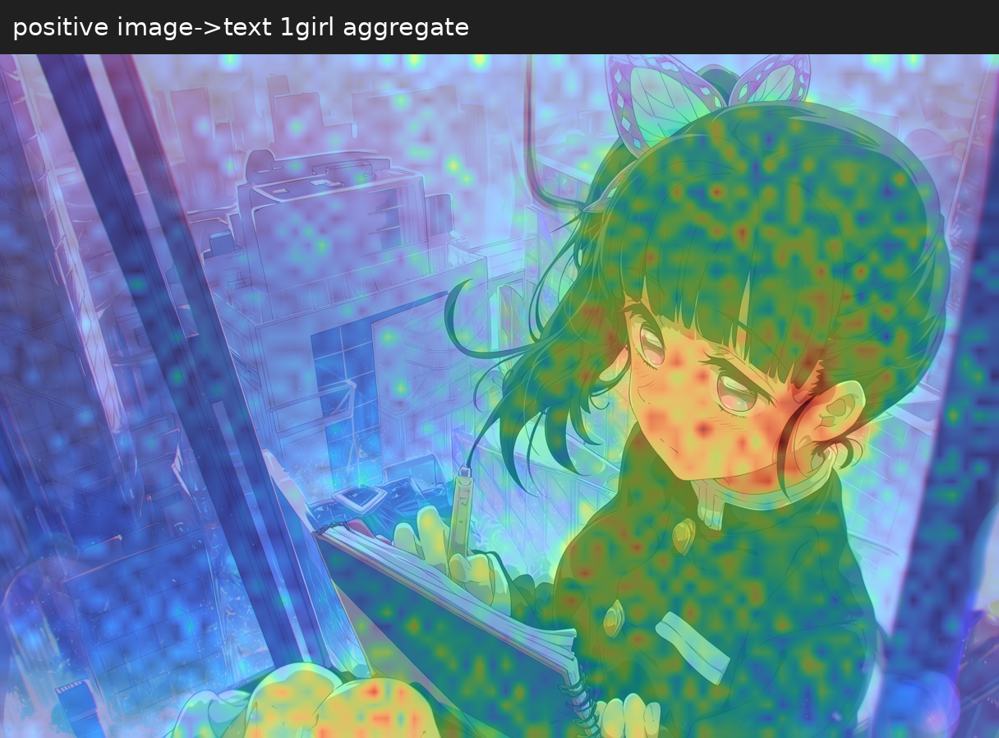
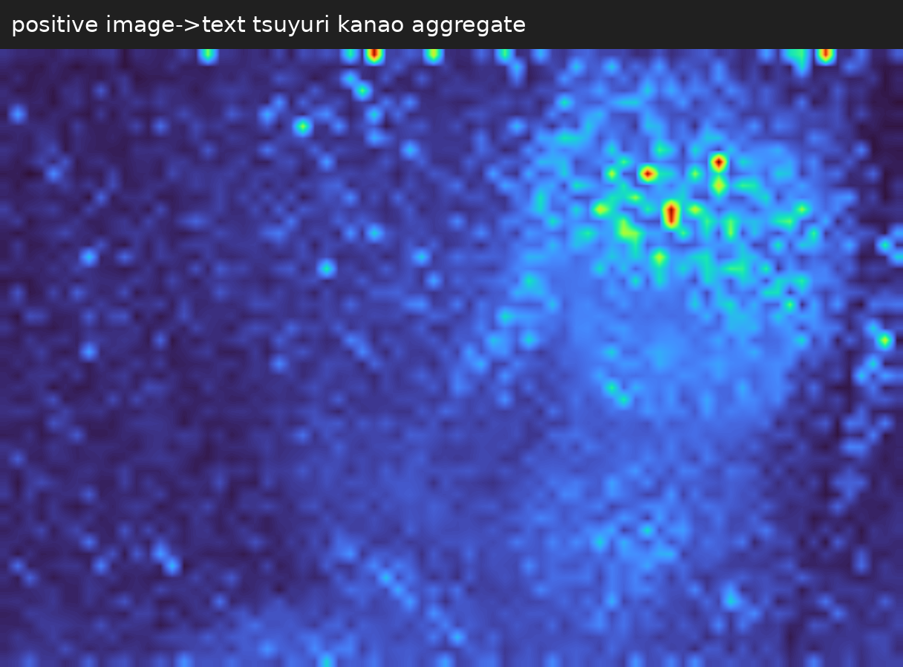
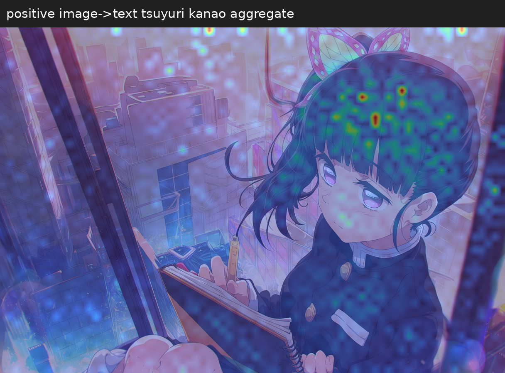
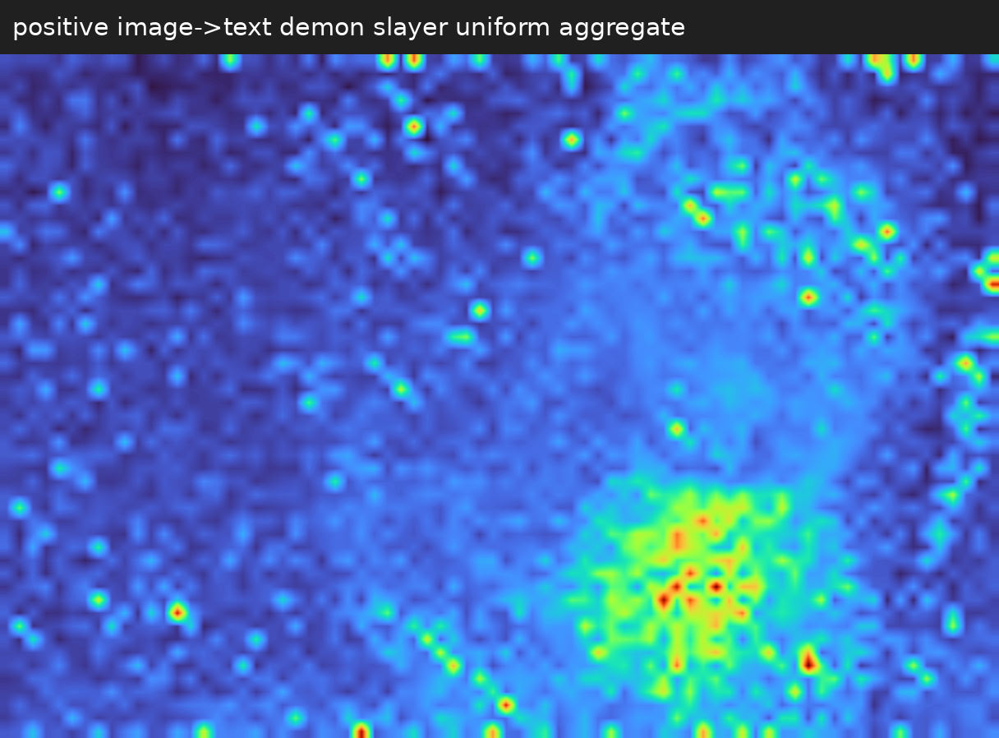
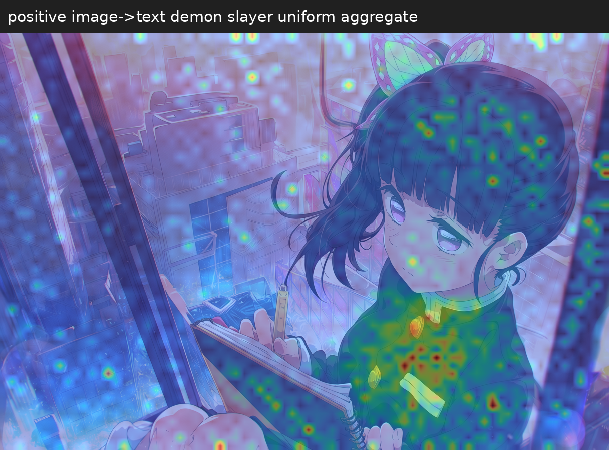

# Anima Heatmap

[English](README.md) | [한국어](README_KR.md)

A Python module and ComfyUI custom nodes for capturing and visualizing Anima image-to-text and image-to-image attention.

## Example

Excerpt from the prompt used for T2I generation:

```text
masterpiece, best quality, ..., 1girl, ..., tsuyuri kanao, kimetsu no yaiba,
demon slayer uniform, ..., holding sketchbook, from above, ..., sunset, ...
```


| Keyword | Heatmap | Overlay |
| --- | --- | --- |
| `sketchbook` |  |  |
| `1girl` |  |  |
| [tsuyuri kanao](https://kimetsu.com/anime/risshihen/character/?chara=kanawo) (character name) |  |  |
| `demon slayer uniform` |  |  |

[Download the workflow PNG](example/kanao/generated.png?raw=true) → drag it onto the ComfyUI canvas.

## Environment & Models

Tested environment:

| Component | Version / Environment |
| --- | --- |
| OS | Google Colab · Linux |
| Python | 3.13.15 |
| PyTorch | 2.14.0+cu130 |
| ComfyUI | 0.37.0 |
| Frontend | 1.53.6 |
| GPU | NVIDIA Tesla T4 · VRAM 14.56 GB |

| Component | Model |
| --- | --- |
| Diffusion | [Anima Base](https://huggingface.co/circlestone-labs/Anima) |
| Text encoder | Qwen 3 0.6B Base |
| VAE | Qwen Image VAE |

## Installation

[Run in Colab](https://colab.research.google.com/github/HisameOgasahara/Anima_HEATMAP/blob/main/notebooks/Anima_Heatmap_ComfyUI.ipynb): select a GPU runtime and run the cells in order.

Local installation (Windows cmd):

```bat
git clone https://github.com/HisameOgasahara/Anima_HEATMAP.git
cd Anima_HEATMAP
uv pip install --python "<ComfyUI Python path>" -e .
xcopy comfyui_anima_heatmap "<ComfyUI path>\custom_nodes\comfyui_anima_heatmap\" /E /I
```

Restart ComfyUI → drag in an example PNG → enter `phrase` in View → run.
Separate multiple keywords with commas or newlines.

Maps are aggregated during sampling by default. Connect the Sampler’s `session` to View; keywords can be changed afterward. Match `aggregation` in Settings and View. Use `keep_records=True` for per-step/layer records or `save_raw=True` to save raw files.

| Aggregation | Method |
| --- | --- |
| `mean` | Average selected heads and captured records |
| `daam` | Sum heads → average layers within each model call → sum calls |

## Project Structure

| Path | Purpose |
| --- | --- |
| `anima_heatmap/` | Q/K → attention probabilities → aggregation → heatmaps and overlays |
| `comfyui_anima_heatmap/` | Model integration, keyword selection, and ComfyUI nodes |
| [`comfyui_anima_profiler/`](comfyui_anima_profiler/README.md) | Sampling compute, transfer, and storage profiling |
| `notebooks/` | Colab setup, model downloads, server, and tunnel |
| `example/` | PNGs with embedded workflows |
| `tests/` | Tests |

## Standalone Module

```bat
uv venv .venv
uv pip install --python .venv\Scripts\python.exe -e .
.venv\Scripts\python.exe -m anima_heatmap "<session directory>" --phrase "blue hair" --image "<image.png>" --output "<output directory>"
```

Session directory: `ComfyUI/output/anima_heatmap/`

## References

- [Anima](https://huggingface.co/circlestone-labs/Anima)
- [ComfyUI Anima](https://github.com/Comfy-Org/ComfyUI/blob/master/comfy/ldm/anima/model.py)
- [attention-map-diffusers](https://github.com/wooyeolBaek/attention-map-diffusers)
- [ComfyUI DAAM](https://github.com/nisaruj/comfyui-daam)
