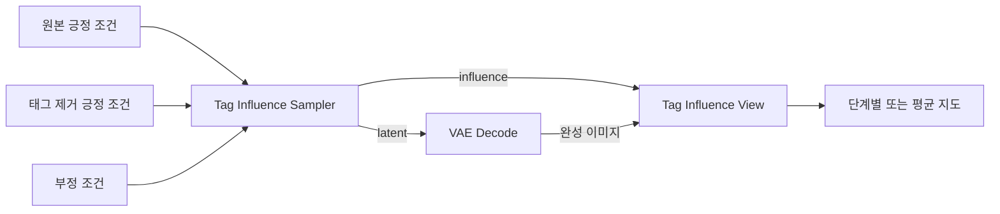

# Anima Tag Influence

[English](README.md) | [한국어](README_KR.md) | [Attention 히트맵](README__HEATMAP_KR.md)

프롬프트의 태그가 이미지의 어디에, 생성 과정의 어느 단계에서 영향을 주는지 비교하는 ComfyUI 커스텀 노드.

매 단계의 동일한 생성 상태에서 원본 긍정 프롬프트와 태그를 제거한 긍정 프롬프트의 예측을 비교한다. 얼굴·옷·배경 등 예측이 크게 달라지는 위치를 밝게 표시하며, 원본 예측으로 다음 단계에 진행한다.



화살표는 노드 출력의 연결을 나타낸다.

## Colab 실행

[Colab에서 열기](https://colab.research.google.com/github/HisameOgasahara/Anima_HEATMAP/blob/feature/tag-influence/notebooks/Anima_Heatmap_ComfyUI.ipynb)

1. GPU 런타임을 선택하고 셀을 순서대로 실행한다. `SOURCE_REF` 기본값은 `feature/tag-influence`다.
2. 다운로드되는 `tag_influence.json`을 보관한다.
3. 서버 실행 셀의 ComfyUI 링크를 열고 JSON을 캔버스에 드래그한다.
4. 모델을 선택하고 프롬프트·샘플링 설정을 조정한 뒤 실행한다.

접속 링크를 아는 사람은 ComfyUI에 접근할 수 있다. 사용 중에는 서버 실행 셀을 유지하고, 종료할 때 셀의 중지 버튼을 누른다.

## 로컬 설치

Windows cmd:

```bat
git clone --branch feature/tag-influence --single-branch https://github.com/HisameOgasahara/Anima_HEATMAP.git
cd Anima_HEATMAP
uv pip install --python "<ComfyUI Python 경로>" -e .
xcopy comfyui_anima_heatmap "<ComfyUI 경로>\custom_nodes\comfyui_anima_heatmap\" /E /I
```

ComfyUI를 재시작하고 [예제 워크플로](example/tag_influence.json?raw=true)를 캔버스에 드래그한다.

| 노드 | 모델·설정 |
| --- | --- |
| `UNETLoader` | `anima-base-v1.0.safetensors` |
| `CLIPLoader` | `qwen_3_06b_base.safetensors`, 타입 `stable_diffusion` |
| `VAELoader` | `qwen_image_vae.safetensors` |

모델 파일: [Anima Base](https://huggingface.co/circlestone-labs/Anima).

## 태그 비교

예제는 `red shirt`를 제거한 영향을 측정한다.

| 입력 | 프롬프트 |
| --- | --- |
| `positive` | `1girl, solo, upper body, looking at viewer, outdoors, daytime, red shirt` |
| `ablated_positive` | `1girl, solo, upper body, looking at viewer, outdoors, daytime` |
| `negative` | `low quality, worst quality, blurry` |

두 긍정 프롬프트를 같은 CLIP으로 인코딩한다. 캐릭터·작가·표정·소품·배경 등 비교할 태그만 바꾸면 된다. 태그 여러 개를 함께 제거하면 그 조합의 영향을 측정한다.

`Tag Influence Sampler`의 `latent`를 VAE Decode로 보내고, 완성 이미지와 `influence`를 `Tag Influence View`에 연결한다. View의 `overlays` 또는 `heatmaps` 출력을 Preview Image에 연결한다.

## 스텝과 표시 설정

Sampler의 `steps`, `seed`, `cfg`, `sampler_name`, `scheduler`, `denoise`는 KSampler와 같은 입력이다. `steps`를 바꾸면 실제 noise schedule에 맞춰 측정하며, 예제의 30스텝을 원하는 수로 변경할 수 있다.

| View 입력 | 동작 |
| --- | --- |
| `view=per_step` | 각 단계 구간의 측정을 평균하여 단계별 지도 출력 |
| `view=aggregate` | 선택한 단계에 속한 모든 측정의 평균 지도 출력 |
| `steps=all` / `last` | 전체 단계 / 마지막 단계 선택 |
| `steps=0,4,8` / `0-9` | 특정 단계 / 연속 범위 선택. 입력은 0부터, 이미지 표시는 1부터 시작 |
| `scale_max=0` | 전체 측정의 최대값을 공통 색 눈금으로 사용 |
| `scale_max>0` | 지정한 최대값으로 색 눈금 고정 |
| `alpha` | 완성 이미지 위에 겹치는 색의 불투명도 |

한 단계에서 모델을 여러 번 계산하는 샘플러는 noise schedule 구간에 따라 호출을 묶는다. 따라서 모델 호출 수와 생성 스텝 수가 다를 수 있다. `details`에는 단계·호출·sigma별 측정값과 출력 순서가 담긴다.

View 설정만 바꾸면 메모리에 남은 측정을 다시 표시한다. 비교 프롬프트를 바꾸면 샘플링부터 다시 실행한다.

## 지도 해석과 자원

지도 값은 같은 생성 상태와 sigma에서 두 CFG 예측의 차이를 sigma로 나눈 뒤, latent 채널 방향의 L2 크기를 구한 값이다. 태그를 제거한 효과에는 달라진 프롬프트 문맥의 영향도 포함된다.

단계별 지도는 최종 완성 이미지 위에 겹친다. 비교용 예측은 다음 단계에 누적되지 않으며, 원본 긍정·부정 조건의 CFG 예측이 생성 경로를 결정한다.

같은 모델로 비교 예측을 추가 계산하고, 차이 지도는 CPU 메모리에 보관한다. 일반적인 CFG 생성에서 태그 하나를 비교하면 이론적인 모델 계산량은 약 두 배이며, 실제 실행 시간과 최대 VRAM은 해상도·샘플러·메모리 배치에 따라 달라진다. 이 기능의 Colab GPU 실행과 최대 VRAM은 아직 측정하지 않았다.
