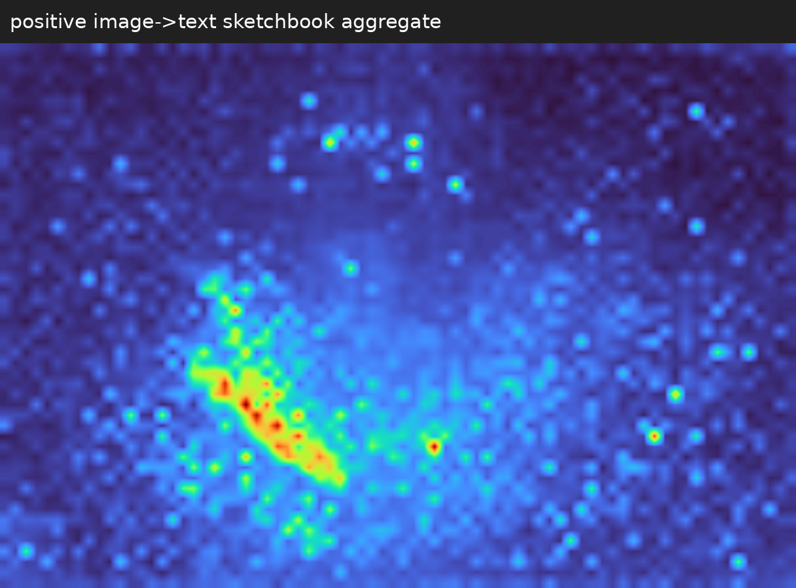
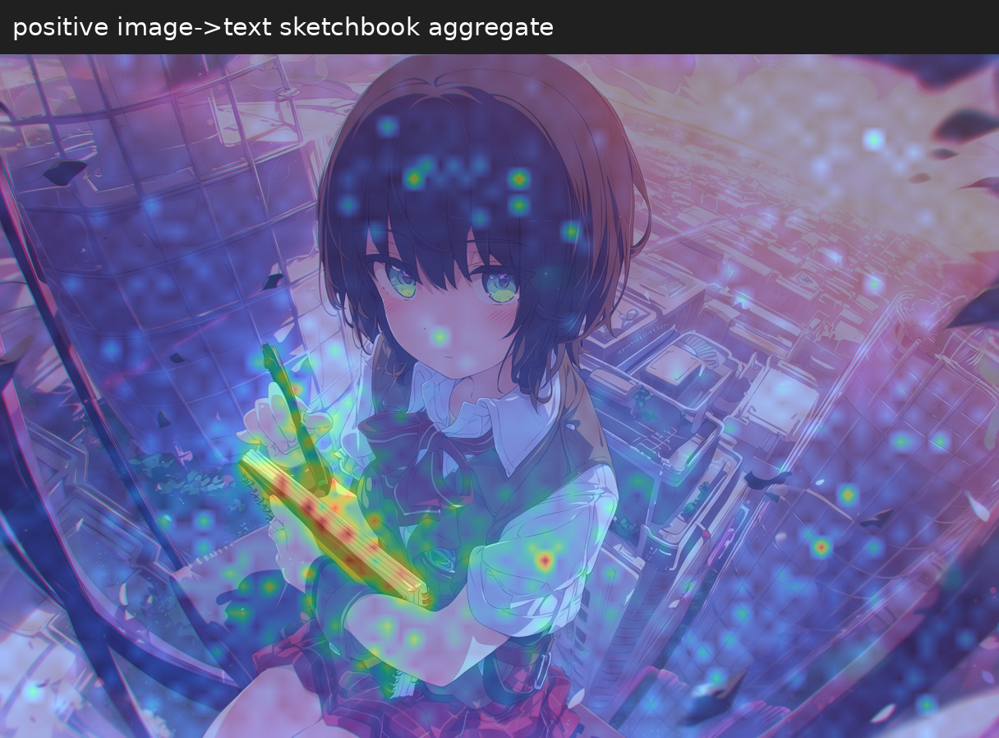
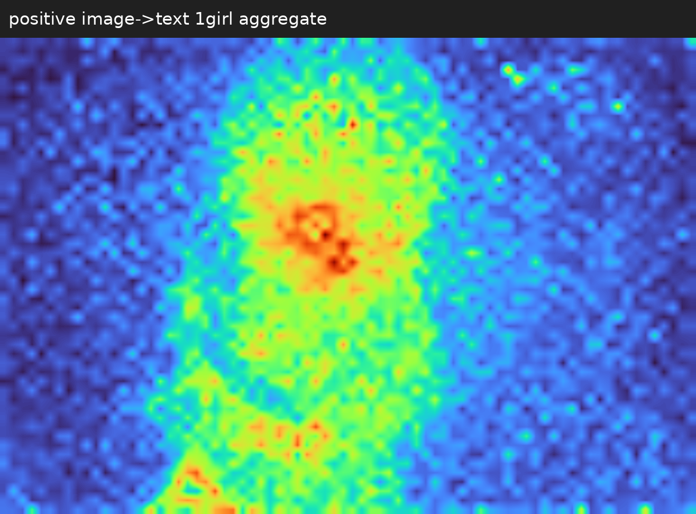
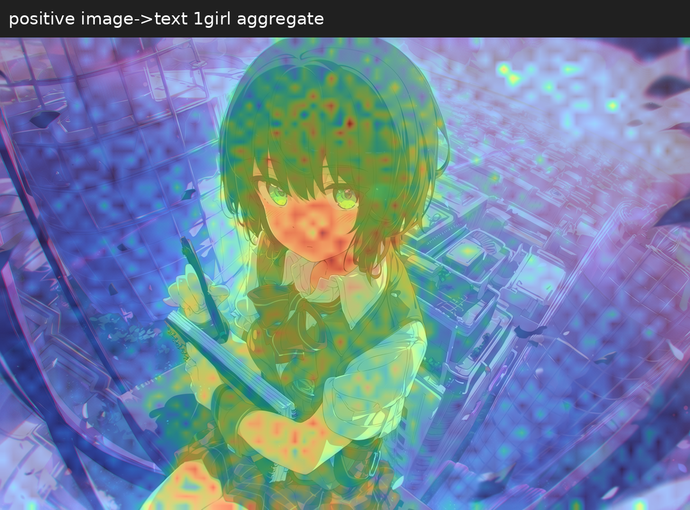
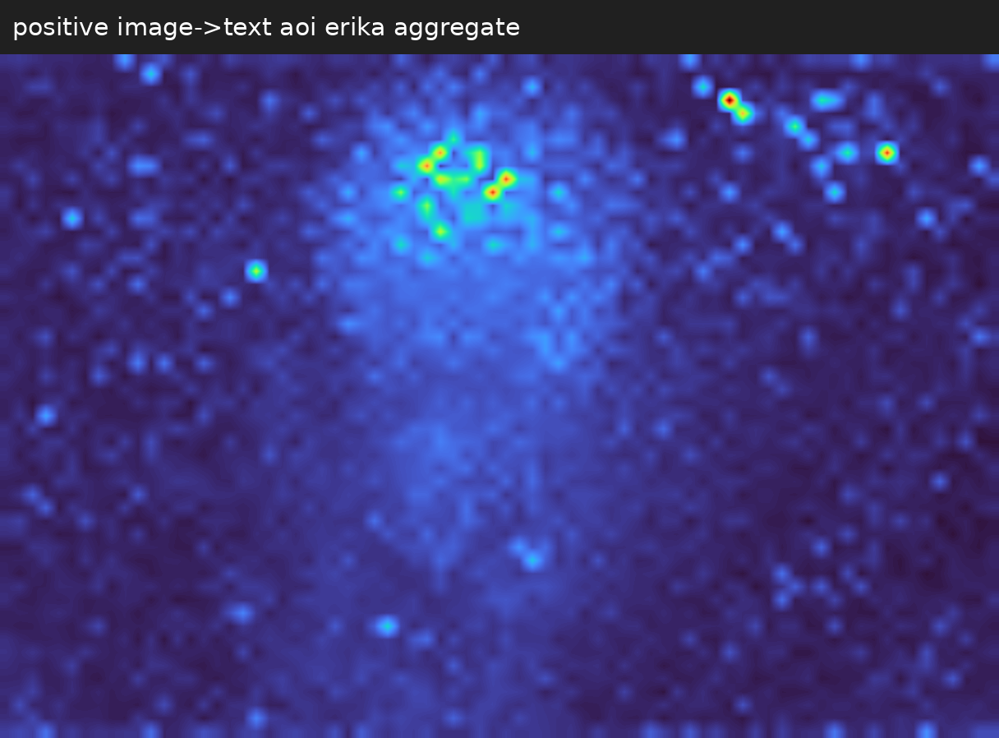
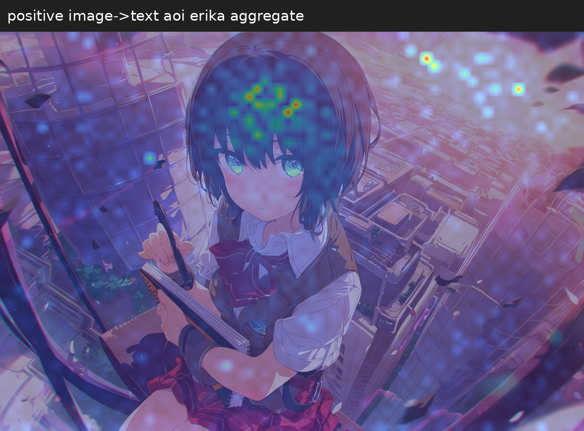

# Anima Heatmap

[English](README.md) | [한국어](README_KR.md)

Anima의 이미지→텍스트·이미지→이미지 attention을 수집하고 시각화하는 Python 모듈과 ComfyUI 커스텀 노드.

## Example

프롬프트 일부:

```text
masterpiece, best quality, ..., 1girl, aoi erika, green eyes, heaven burns red,
..., brown vest, red miniskirt, ..., holding sketchbook, from above, ..., sunset, ...
```


| 키워드 | 히트맵 | 오버레이 |
| --- | --- | --- |
| `sketchbook` |  |  |
| `1girl` |  |  |
| `aoi erika` |  |  |

[워크플로 포함 PNG 다운로드](example/generated.png?raw=true) → ComfyUI 캔버스에 드래그.

## 환경·모델

실행 확인 환경:

| 항목 | 버전·환경 |
| --- | --- |
| OS | Google Colab · Linux |
| Python | 3.13.15 |
| PyTorch | 2.14.0+cu130 |
| ComfyUI | 0.37.0 |
| Frontend | 1.53.6 |
| GPU | NVIDIA Tesla T4 · VRAM 14.56 GB |

| 구성 | 모델 |
| --- | --- |
| Diffusion | [Anima Base](https://huggingface.co/circlestone-labs/Anima) |
| Text encoder | Qwen 3 0.6B Base |
| VAE | Qwen Image VAE |

## 설치

[Colab에서 실행](https://colab.research.google.com/github/HisameOgasahara/Anima_HEATMAP/blob/main/notebooks/Anima_Heatmap_ComfyUI.ipynb): GPU 런타임을 선택하고 셀을 순서대로 실행한다.

로컬 설치 (Windows cmd):

```bat
git clone https://github.com/HisameOgasahara/Anima_HEATMAP.git
cd Anima_HEATMAP
uv pip install --python "<ComfyUI Python 경로>" -e .
xcopy comfyui_anima_heatmap "<ComfyUI 경로>\custom_nodes\comfyui_anima_heatmap\" /E /I
```

ComfyUI 재시작 → 예제 PNG 드래그 → View의 `phrase` 입력 → 실행.
여러 키워드는 쉼표나 줄바꿈으로 구분한다.

기본은 생성 중 통합이며 Sampler의 `session`을 View에 연결한다. 키워드는 실행 후에도 바꿀 수 있다. Settings와 View의 `aggregation`을 맞춘다. 단계·layer별 원본 분석은 `keep_records=True`, 원본 파일 보관은 `save_raw=True`를 사용한다.

| 집계 모드 | 방식 |
| --- | --- |
| `mean` | 선택한 head와 수집 기록을 평균 |
| `daam` | head 합 → 모델 호출별 layer 평균 → 호출 전체 합 |

## 구조

| 경로 | 역할 |
| --- | --- |
| `anima_heatmap/` | Q/K → attention 확률 → 집계 → 히트맵·오버레이 |
| `comfyui_anima_heatmap/` | 모델 연결·키워드 선택·ComfyUI 노드 |
| [`comfyui_anima_profiler/`](comfyui_anima_profiler/README.md) | 샘플러 내부 계산·전송·저장 시간 측정 |
| `notebooks/` | Colab 설치·모델 다운로드·서버·터널 실행 |
| `example/` | 워크플로 포함 PNG |
| `tests/` | 테스트 |

## 독립 모듈

```bat
uv venv .venv
uv pip install --python .venv\Scripts\python.exe -e .
.venv\Scripts\python.exe -m anima_heatmap "<세션 폴더>" --phrase "blue hair" --image "<이미지.png>" --output "<출력 폴더>"
```

세션 저장 위치: `ComfyUI/output/anima_heatmap/`

## 참조

- [Anima](https://huggingface.co/circlestone-labs/Anima)
- [ComfyUI Anima](https://github.com/Comfy-Org/ComfyUI/blob/master/comfy/ldm/anima/model.py)
- [attention-map-diffusers](https://github.com/wooyeolBaek/attention-map-diffusers)
- [ComfyUI DAAM](https://github.com/nisaruj/comfyui-daam)
