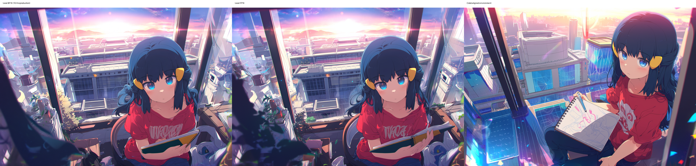
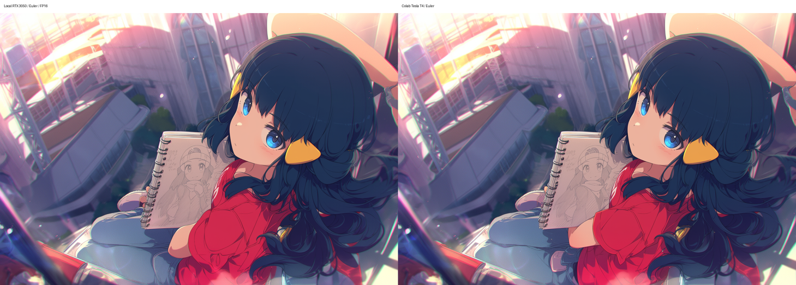
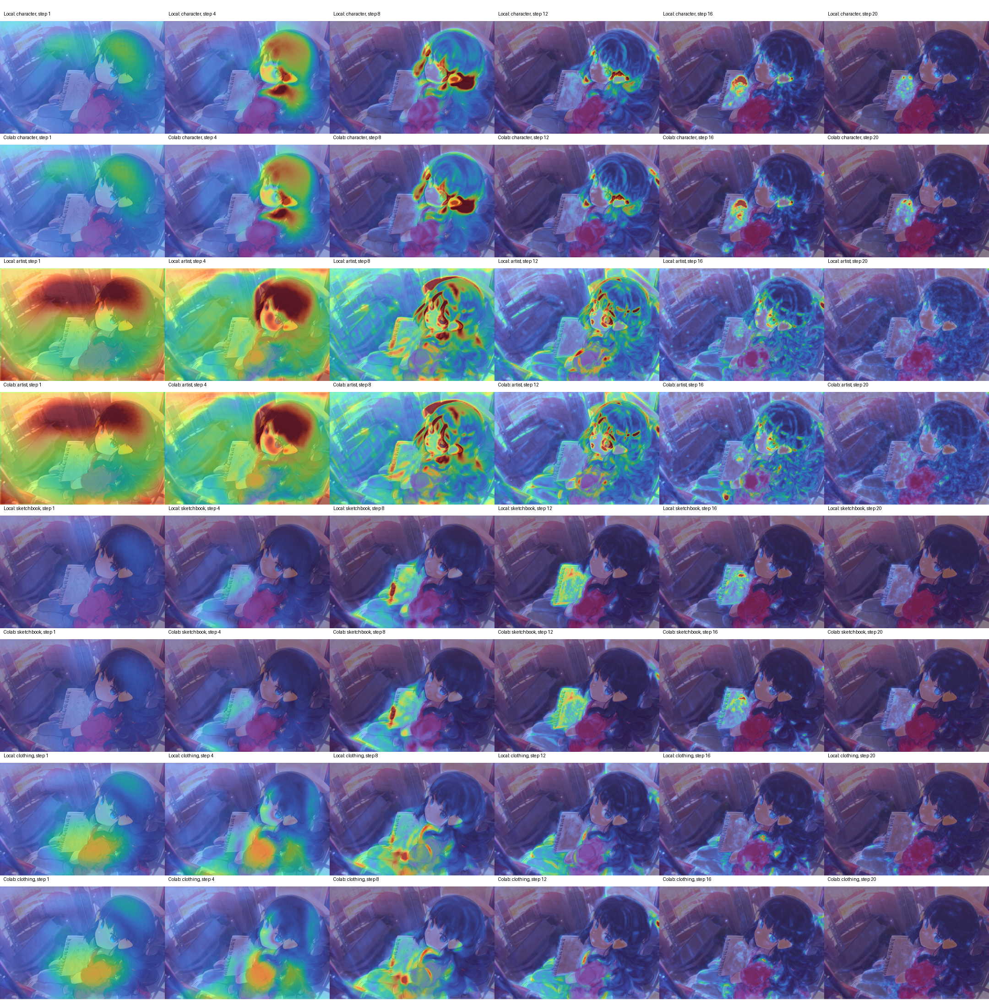
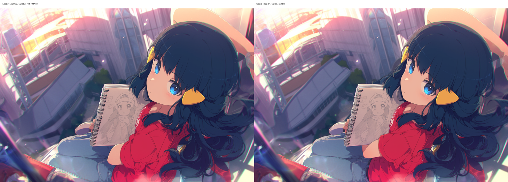

# 빛나 feature ablation 재현: 로컬 RTX 3050과 코랩 Tesla T4

2026-10-07. 가장 큰 변화는 샘플러를 `er_sde`에서 `euler`로 바꿨을 때 나타났다. 로컬·코랩 생성 이미지의 RMSE는 **0.32037 → 0.03395**, 상관계수는 **0.314 → 0.991**로 변했다. 캐릭터·작가·스케치북·의상 히트맵의 평균 오차는 **79~85% 감소**했다.

## 10/4 결과의 로컬 재현

10/4의 예측 비교 방식을 반영한 커스텀 노드로 빛나·카나오·호시노 아이를 다시 생성했다. 세 캐릭터에서 최종 latent와 네 타겟의 원본 영향 배열이 10/4 저장값과 일치했다. 카나오·아이의 생성 이미지 픽셀도 일치했다.

| 비교 대상 | 로컬 재현 결과 |
| --- | --- |
| 빛나 | 최종 latent 일치 · 네 영향 배열의 최대 절대 차이 0 |
| 카나오 | 최종 latent·생성 이미지 픽셀 일치 · 네 영향 배열의 최대 절대 차이 0 |
| 호시노 아이 | 최종 latent·생성 이미지 픽셀 일치 · 네 영향 배열의 최대 절대 차이 0 |

커스텀 노드 `influence.py`는 로컬 수정본과 코랩에서 내려받은 파일의 SHA-256이 같았다.

```text
89a75566b8d9a37e90d2837913444e0631791a77cd822ef5237c3c2c7a5e64b9
```

## 환경과 고정 조건

| 항목 | 로컬 | 코랩 |
| --- | --- | --- |
| OS | Windows | Linux |
| GPU | NVIDIA GeForce RTX 3050 | Tesla T4 |
| Python | 3.13.5 | 3.13.15 |
| ComfyUI | 0.20.1 | 0.20.1 |
| ComfyUI 커밋 | `64b8457f55cd7fb54ca7a956d9c73b505e903e0c` | 동일 |
| PyTorch | `2.11.0+cu128` | ComfyUI 서버 로그: `2.11.0+cu128` |
| CUDA 빌드 | 12.8 | ComfyUI 서버 로그: 12.8 |
| 확산 모델 정밀도 | 기본 로드 BF16 · 비교 실험 FP16 | 서버 로그 FP16 |
| 텍스트 인코더 | FP16 옵션에도 모델의 설정 dtype은 BF16 | 서버 로드 로그 FP16 |
| VAE 정밀도 | 비교 실험 FP16 | 서버 로그 FP16 |
| Attention | PyTorch 자동 선택 · 후속 실험 Math 고정 | PyTorch 자동 선택 · 후속 실험 Math 고정 |

코랩 Math 실험에서는 실행 로그의 `SDPA: MATH로 고정` 출력을 확인했다. 로컬 Math 실험에서는 해당 연산 함수가 6,961회 호출됐다.

| 항목 | 조건 |
| --- | --- |
| 확산 모델 | `anima-base-v1.0.safetensors` |
| 텍스트 인코더 | `qwen_3_06b_base.safetensors` |
| VAE | `qwen_image_vae.safetensors` |
| 시드 | `791906088230398` |
| 해상도 | 1216 × 832 |
| 샘플링 | 20스텝 · CFG 4.5 · `simple` · denoise 1.0 |
| 제거 대상 | `dawn (pokemon)` · `@ogipote` · `sketchbook` · `red t-shirt`와 `denim jeans` |
| 표시 단계 | 1 · 4 · 8 · 12 · 16 · 20 |
| 색 눈금 | 0〜2.249413013458252 · Turbo · overlay alpha 0.6 |

코랩 결과 세 묶음은 각각 `er_sde`, `euler`, `euler`+Math였다. 각 묶음의 49개 PNG에 저장된 실행 그래프는 묶음 안에서 같았다. 첫째·둘째 묶음 사이에서는 네 ablation 노드의 샘플러 이름만 바뀌었고, 둘째·셋째 묶음의 실행 그래프는 같았다. Math 적용은 서버 실행 과정에서 이루어졌다.

## FP16로 바꾼 로컬 그림은 기존 구도를 유지했다

왼쪽부터 로컬 기본 BF16, 로컬 FP16, 코랩 `er_sde` 결과다. 로컬 두 그림은 인물과 책의 배치가 비슷했고, 코랩에서는 스케치북의 펼친 면과 인물의 위치가 달라졌다.



| 로컬 정밀도 | 코랩과 생성 이미지 RMSE | 상관계수 |
| --- | ---: | ---: |
| 기본 BF16 | 0.32030 | 0.318 |
| FP16 | 0.32037 | 0.314 |

FP16 변경 후 히트맵 오차는 캐릭터 11.3%, 작가 1.9%, 스케치북 14.5%, 의상 14.7% 감소했다.

## 추가 GPU 난수와 Euler에서 나타난 큰 변화

현재 ComfyUI는 시작 노이즈를 CPU에서 생성하고, `er_sde`가 매 단계 추가하는 노이즈를 샘플링 tensor와 같은 장치에서 생성한다. GPU 난수 생성에 사용한 시드는 `791906088230398`, 배열 크기는 `(1, 16, 1, 104, 152)`, dtype은 FP32였다.

동일한 검사 코드를 실행한 두 환경에서 난수 배열의 SHA-256이 달랐다. 이 검사 당시 로컬은 `2.11.0+cu128`, 코랩 노트북 프로세스는 `2.11.0+cu130`이었다.

```text
로컬 RTX 3050: c6f03d8cfdd3ff37a08c1c20902ec7f8ab89557ac08ff2cad15639c4f80849c5
코랩 Tesla T4: 7bb045821123bcaa72214dbf3cfdf1078546c65cc0539d16e9f68bdea4d08043
```

단계별 추가 난수를 사용하지 않는 `euler`로 양쪽을 다시 생성하자 인물·책·도시 배경의 구도가 가까워졌다. 왼쪽은 로컬 FP16, 오른쪽은 코랩이다.



| 로컬 FP16과 코랩 비교 | 생성 이미지 RMSE | 상관계수 |
| --- | ---: | ---: |
| `er_sde` | 0.32037 | 0.314 |
| `euler` | 0.03395 | 0.991 |

Euler 전환에서 생성 이미지 RMSE는 **89.4% 감소**했다. 타겟별 히트맵 변화는 다음과 같았다.

| 타겟 | er_sde 평균 RMSE | Euler 평균 RMSE | 오차 감소 | Euler 단계별 평균 강도 상관 |
| --- | ---: | ---: | ---: | ---: |
| 캐릭터 | 0.09360 | 0.01549 | 83.4% | 0.9998 |
| 작가 | 0.14527 | 0.02243 | 84.6% | 0.9999 |
| 스케치북 | 0.07457 | 0.01498 | 79.9% | 0.9988 |
| 의상 | 0.08037 | 0.01675 | 79.2% | 0.9997 |

각 타겟의 윗행은 로컬, 아랫행은 코랩이며 열은 1·4·8·12·16·20스텝이다. 캐릭터 영향은 얼굴·머리, 스케치북 영향은 책·손, 의상 영향은 몸통에 모였다. 작가 영향은 초반 인물·배경에 넓게 나타나고 후반에 세부 영역으로 좁아졌다. 1·4·8스텝의 공간 상관계수는 모든 타겟에서 0.997 이상이었다.



## Math attention 고정 후에는 비슷한 수준의 차이가 남았다

양쪽을 `euler`와 Math attention으로 다시 생성했다. 그림의 구도는 유지됐고, 로컬·코랩 이미지 RMSE는 **0.04018**, 상관계수는 **0.987**이었다.



| 타겟 | 자동 attention 평균 RMSE | Math 평균 RMSE | 오차 변화 |
| --- | ---: | ---: | --- |
| 캐릭터 | 0.01549 | 0.01602 | 3.4% 증가 |
| 작가 | 0.02243 | 0.02444 | 9.0% 증가 |
| 스케치북 | 0.01498 | 0.01423 | 5.0% 감소 |
| 의상 | 0.01675 | 0.01935 | 15.5% 증가 |

Math에서도 단계별 평균 강도 상관은 0.9953〜0.9997이었다. 얼굴·머리, 책·손, 몸통에 나타나는 주요 반응은 양쪽에서 이어졌고, 후반 단계의 세부 분포에는 차이가 남았다.

[Math 단계별 히트맵 비교 사진](images/feature_ablation_reproduction_20261007/math_heatmaps.png)

## ComfyUI 워크플로 불러오기

[마지막 Euler·Math 실험의 원본 PNG](../example/tag_influence/dawn_euler_math_workflow.png)를 다운로드해 ComfyUI 캔버스에 드래그하면 캐릭터·작가·스케치북·의상 비교 워크플로를 불러올 수 있다.

PNG에 저장된 샘플링 조건은 seed `791906088230398`, 20스텝, CFG 4.5, `euler`, `simple`이다. FP16과 Math attention은 위 실험 환경에 맞춰 서버에서 별도로 설정한다.

## 비교 수치와 저장 결과

생성 이미지 RMSE와 상관계수는 RGB 픽셀을 0〜1로 변환해 계산했다. 히트맵 수치는 PNG의 제목 영역을 제외한 1216 × 832 영역에서 Turbo 256색을 0〜1 강도로 역변환한 값이다. 평균 RMSE는 표시한 여섯 단계의 RMSE 평균이며, 시간 상관은 여섯 단계의 공간 평균 강도 사이의 Pearson 상관이다.

- [10/4 빛나의 로컬 재현](../output/dawn_legacy_feature_ablation_20261006/comparison.json)
- [10/4 카나오·아이의 로컬 재현](../output/character_legacy_reproduction_20261006/comparison.json)
- [er_sde 정밀도 비교](../output/dawn_fp16_colab_comparison_20261007/comparison.json)
- [Euler 로컬·코랩 비교](../output/dawn_euler_colab_comparison_20261007/comparison.json)
- [Euler·Math 로컬·코랩 비교](../output/dawn_euler_math_colab_comparison_20261007/comparison.json)
- [로컬 Math 실행 환경](../output/dawn_euler_math_colab_comparison_20261007/environment.json)
