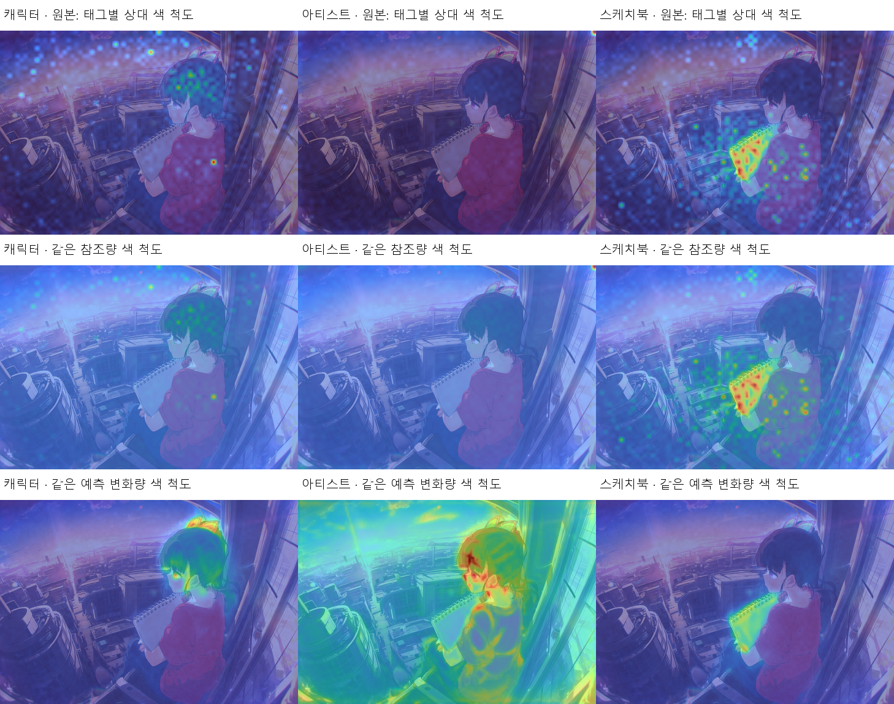
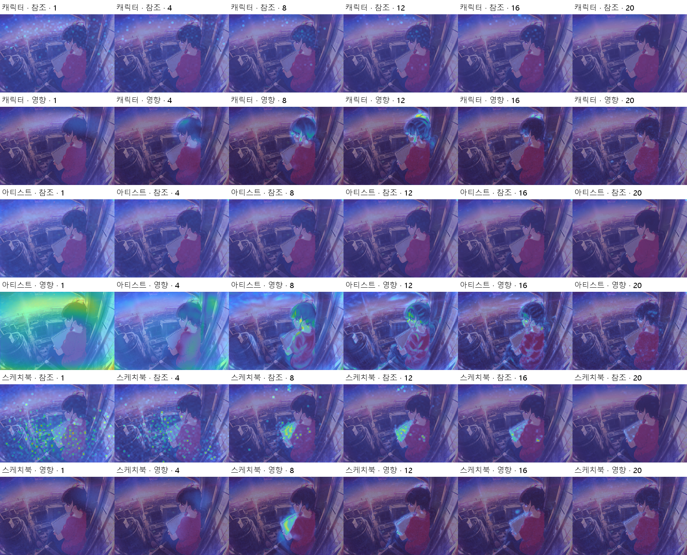
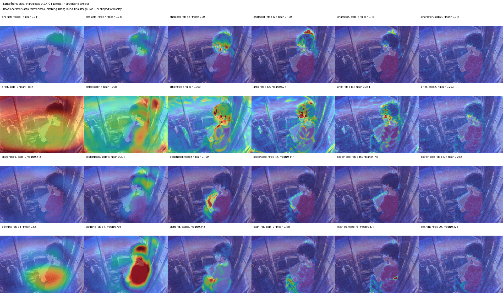
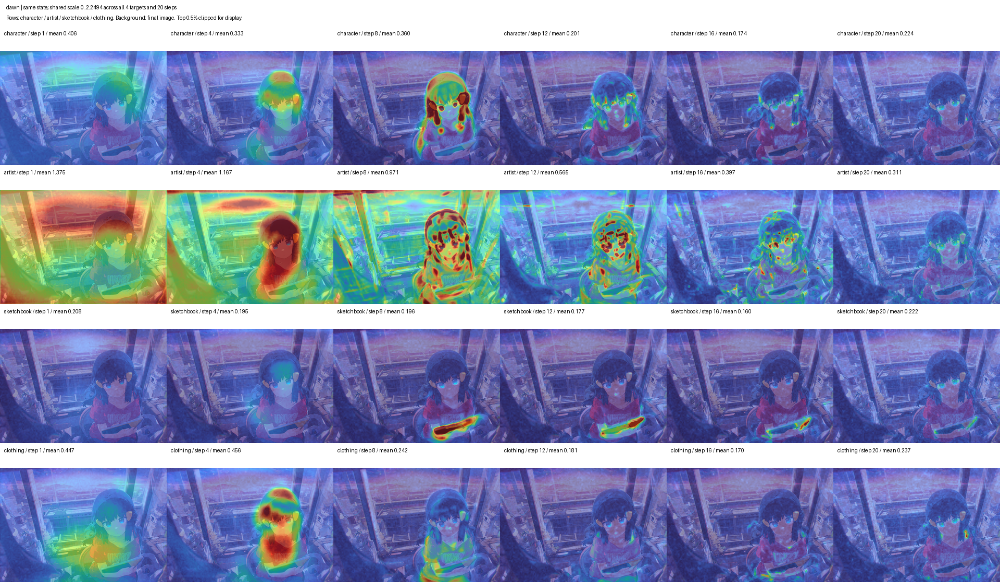

# 작가·캐릭터 태그의 영향 지도: attention에서 feature ablation으로

Attention 지도에서 약하게 보이던 작가 태그와 점 형태로 나타나던 캐릭터 태그의 영향을 확인하기 위해, 같은 생성 상태에서 태그를 제거하고 예측 변화를 측정했다. 카나오·빛나에서는 캐릭터의 얼굴·머리, 작가의 인물·배경, 소품의 책 주변에 변화가 드러났다.

## 출발점: 책은 보이는데 작가·캐릭터는 읽기 어려웠다

스케치북을 들고 있는 카나오를 생성하고 `tsuyuri kanao`, `@ogipote`, `sketchbook`의 attention을 살폈다. 확인하고 싶었던 것은 캐릭터를 만드는 부분, 화풍이 작용하는 범위, 소품이 그려지는 위치였다.

20스텝 비교 실험의 열은 왼쪽부터 캐릭터·작가·스케치북이다. 첫째 행은 태그마다 색을 상대 정규화한 attention, 둘째 행은 태그 간 공통 색 눈금을 적용한 attention, 셋째 행은 해당 토큰의 정보 전달을 차단했을 때의 예측 변화다.

- 캐릭터 attention은 머리와 배경의 작은 점으로 분산됐다.
- 작가 attention은 공간 패턴이 약하게 드러났다.
- 스케치북 attention은 책 주변에 강하게 나타나 물체 위치를 읽기 쉬웠다.
- 정보 차단의 영향 지도에서는 캐릭터의 얼굴·머리 주변, 작가의 인물·배경 전반에 변화가 나타났다.

이 차이에서 다음 질문이 생겼다. **태그의 참조 비율과, 그 태그가 생성 예측을 바꾸는 힘은 어떻게 연결되는가?**

## 스텝을 나누면 초반의 작가 영향이 드러날까

기존 README 예제의 attention은 30스텝 전체·모든 층을 DAAM 방식으로 집계했다. 초기의 넓은 반응과 후기의 국소 반응을 따로 보기 위해, 비교 실험에서는 20스텝·28개 층의 attention을 수집하고 스텝별 지도를 만들었다.

아래 열은 1·4·8·12·16·20스텝이다. 행은 캐릭터 attention·영향, 작가 attention·영향, 스케치북 attention·영향 순서다. 여기서 영향은 attention 내부의 해당 토큰 V를 0으로 바꿨을 때의 예측 변화다.

작가 attention과 영향량은 모두 초반에 크고 후반에 작아졌다. 작가의 스텝별 평균 참조량과 평균 영향량의 상관은 카나오 0.980, 아이 0.971, 빛나 0.956이었다. 시간 흐름은 비슷했고, 지도에서 나타나는 공간 분포와 변화량의 크기는 달랐다.

Attention 지도에는 attention끼리, 영향 지도에는 영향끼리 공통 색 눈금을 적용했다. 같은 방법 안에서는 초반·후반과 태그 간 강도를 비교할 수 있다.

## 참조 비율과 전달되는 정보

Attention의 계산은 다음과 같다.

$$
A=\mathrm{softmax}\left(\frac{QK^{\mathsf T}}{\sqrt{d}}\right),
\qquad O=AV
$$

$Q$와 $K$는 이미지 query와 텍스트 key, $d$는 head의 key 차원이다. $A$는 이미지 위치가 각 텍스트 토큰을 참조하는 비율이고, $V$는 그 토큰이 전달하는 벡터다. 출력 $O$에는 참조 비율과 전달 벡터가 함께 들어간다. 그 뒤의 모델 계산이 최종 생성 예측을 만든다.

20스텝 평균을 비교하면 작가 태그의 attention은 스케치북보다 작았고, V 차단에 따른 예측 변화는 작가 쪽이 컸다.

| 캐릭터 | 작가 attention | 스케치북 attention | 작가 영향 L2 | 스케치북 영향 L2 |
| --- | ---: | ---: | ---: | ---: |
| 카나오 | 0.000970 | 0.001172 | 0.714 | 0.191 |
| 호시노 아이 | 0.001009 | 0.001180 | 0.769 | 0.198 |
| 빛나 | 0.000986 | 0.001187 | 0.733 | 0.189 |

Attention 열은 선택한 태그 토큰·층·head·공간·스텝의 평균 참조 비율이다. 영향 열은 V 차단으로 발생한 sigma 보정 예측 차이의 채널 L2를 공간·스텝에 걸쳐 평균한 값이다. 이 조건에서 작가의 영향량은 스케치북의 약 3.7~3.9배였다.

## 태그 자체를 제거하는 feature ablation

커스텀 노드에는 원본 프롬프트와 태그를 제거한 프롬프트를 각각 입력하는 방식을 넣었다. 입력의 일부를 바꾸고 출력 차이를 측정하는 [Feature Ablation](https://captum.ai/api/feature_ablation.html)의 원리를 생성 과정에 적용했다.

| 실험 | 바꾼 대상 |
| --- | --- |
| 앞의 attention 비교 | 원본 프롬프트를 유지하고 각 층의 해당 토큰 V를 0으로 설정 |
| 태그 제거 비교·커스텀 노드 | 태그를 삭제한 프롬프트를 다시 인코딩하여 비교 조건으로 사용 |

매 단계에서 같은 생성 상태 $x_t$와 노이즈 수준 $\sigma_t$로 두 예측을 계산한다. 원본 프롬프트의 예측으로 다음 단계에 진행하고, 비교 차이는 지도에 기록한다.

$$
\begin{aligned}
\Delta v_t &= \frac{D_{\mathrm{full}}(x_t,\sigma_t)-D_{\mathrm{removed}}(x_t,\sigma_t)}{\sigma_t} \\
H_t(h,w) &= \left\|\Delta v_t(:,h,w)\right\|_2
=\sqrt{\sum_{c=1}^{C}\left(\Delta v_t(c,h,w)\right)^2}
\end{aligned}
$$

$D_{\mathrm{full}}$과 $D_{\mathrm{removed}}$는 원본·태그 제거 프롬프트의 CFG denoised 예측이며, 같은 부정 조건과 CFG를 사용한다. $c$는 latent 채널, $(h,w)$는 latent의 공간 위치다.

## 카나오와 빛나에서 드러난 차이

태그 제거 결과의 행은 캐릭터·작가·스케치북·의상, 열은 1·4·8·12·16·20스텝이다. 각 캐릭터의 네 태그·전체 스텝에 같은 색 눈금을 적용하고, 표시에서는 상위 0.5% 값을 눈금 상한으로 잘랐다. 배경은 최종 완성 이미지다.

### 카나오

캐릭터 태그의 영향은 얼굴·머리와 머리 장식 주변에 나타났다. 작가 태그는 초반의 넓은 배경·인물 영역에서 시작해 후반에 인물 윤곽과 세부 영역으로 좁아졌다. 스케치북은 중간 단계부터 책과 손 주변에 반응이 모였다. 의상 태그는 초기 몸통에서 큰 변화를 보였다.

### 빛나

캐릭터 태그를 제거한 변화가 얼굴·머리 주변에 강하게 나타났다. 작가 태그의 초기 영향은 인물과 배경에 넓게 퍼졌고, 스케치북은 책 주변에 국소적으로 나타났다. 카나오와 빛나 모두 태그별로 예측을 바꾸는 위치와 시점이 구분됐다.

| 대상 | 제거한 태그 |
| --- | --- |
| 캐릭터 | `tsuyuri kanao` / `dawn (pokemon)` / `hoshino ai (oshi no ko)` |
| 작가 | `@ogipote` |
| 소품 | `sketchbook` |
| 의상 | `red t-shirt`, `denim jeans` |

캐릭터 비교에서는 작품명 태그를 유지했고, 의상 비교에서는 두 의상 태그를 함께 제거했다.

## 실험 조건과 기능 연결

| 항목 | 조건 |
| --- | --- |
| 저장된 실험 | `tag_map_comparison_20261004`, `matched_influence_clothing_20261004` |
| 모델 | Anima Base v1.0 · Qwen 3 0.6B Base · Qwen Image VAE |
| seed | `791906088230398` |
| 해상도 | 1216 × 832 |
| 샘플링 | 20스텝 · CFG 4.5 · `er_sde` · `simple` |
| 공통 장면 | 붉은 티셔츠·청바지·스케치북·도시 배경·석양 |

Attention은 토큰의 참조 위치를, feature ablation은 태그 제거에 따른 예측 반응을 보여준다. 작가·캐릭터의 영향 위치와 시점을 살피는 데 두 관측을 함께 사용했고, 태그 제거 측정을 `Tag Influence Sampler`와 `Tag Influence View`로 연결했다. 노드의 단계별 지도는 Sampler에 설정한 스텝 수를 따른다.

[커스텀 노드 사용법](../README_KR.md) · [기존 attention 히트맵](../README__HEATMAP_KR.md)
